## Persone

- Andrea De carolis — Grusp · Master of Ceremonies
- Emiliano Pisu  — Dev Dojo · Senior Design Engineer — Back to CSS
- Chiara Cielo Longobardi — · Designer — Un focus sul focus
- Marco Pollacci — 40 Factory · Senior Frontend Developer — Meno build, più runtime: creare un Design System flessibile con il CSS di oggi
- Tamer Abdel Maaboud — Citynews SPA · UX | Frontend dev — L’Effetto Farfalla nel CSS
- Luca Ucciero — Freelance (Devpunks) · Senior Frontend Engineer — Oklab Color Space
- Giulia Laco — WebMatter · Web designer/typographer e Web developer — Perchè mi piacciono così tanto i font variabili
-  Giacomo  Zinetti — · — Contro il mito della disruption: CSS e il valore di ciò che dura
- Davide Di Pumpo — Freelance (Ex Amazon) · Senior Frontend Developer — Resilienza: farsi una doccia con il CSS
- Andrea Verlicchi — SpeedKit · Google Developer Experts — Ehi Gemini, sistema il CSS! Parlare con i DevTools in linguaggio naturale

## Talks

### Back to CSS

- View trasiction
- Snapping

Future feature (entro fine anno):

-  typed attr
	-  leggere contenuto html senza JS
	-  si può combinare con if per la dichiaratività
- if()
	- possono essere nestate
- custom function
	- una funziona ha solo una return o delle media query e poi una return
	- si può usare una if dentro le funzioni

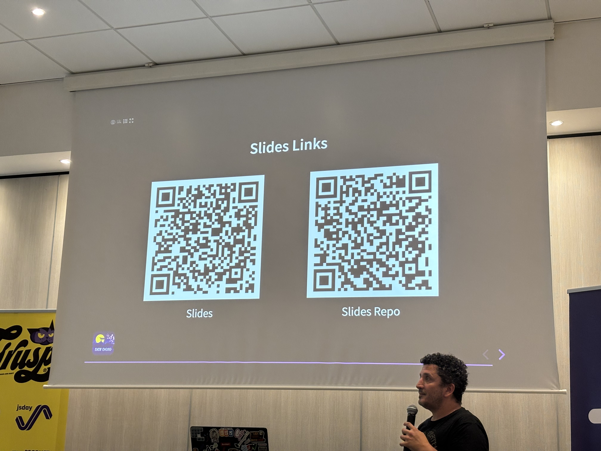

### Un focus sul focus

- focus-visible
	- solo box-shadow non funziona **MAI USARE `none`**
	- controllare sempre il contrasto (3:1 necessario)
		- sia per sfondo di pagina sia per elementi adiacenti
	- si può valutare indicatore di default del browser
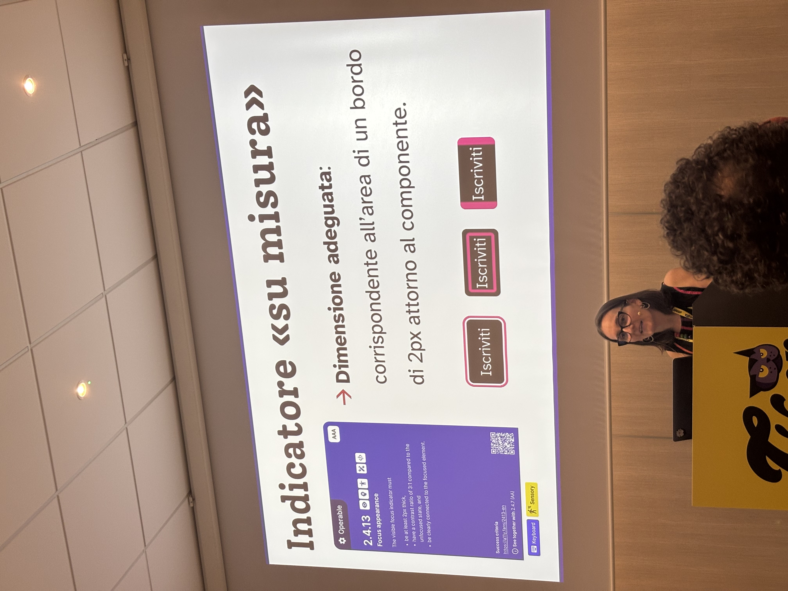

- gestire sempre i focus nei popup
- gestire focus nei sottomenu

Plugin utili per i controlli:

- cav a11y

#### Slide

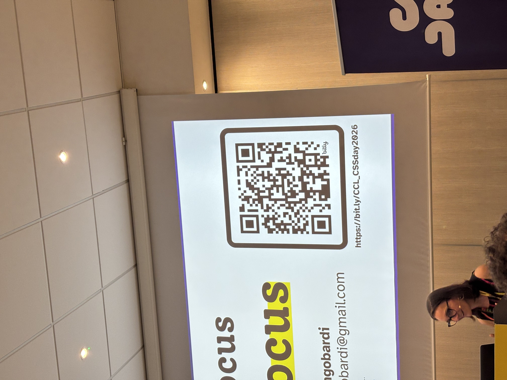

### Meno build, più runtime: creare un Design System flessibile con il CSS di oggi

#### Feature esistenti

- @layer (gestire la cascata in maniera esplicita)
- @scope (isolare un subtree del DOM per lo styling)
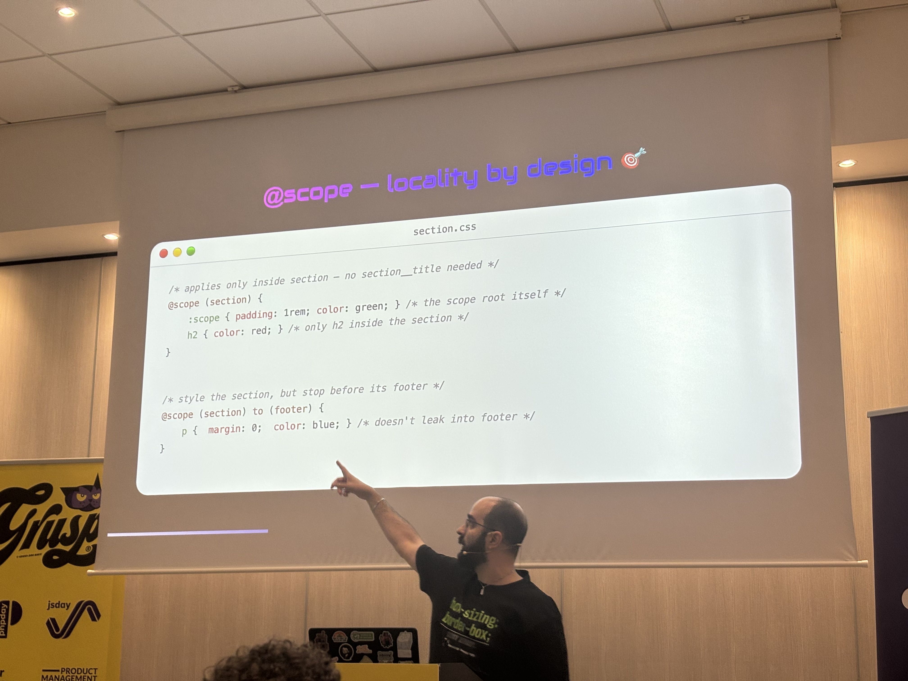
- @property
- color-mix (prende due colori e li mergia — Utile per calcolare varianti darken e lighter)
- relative-color
- clamp
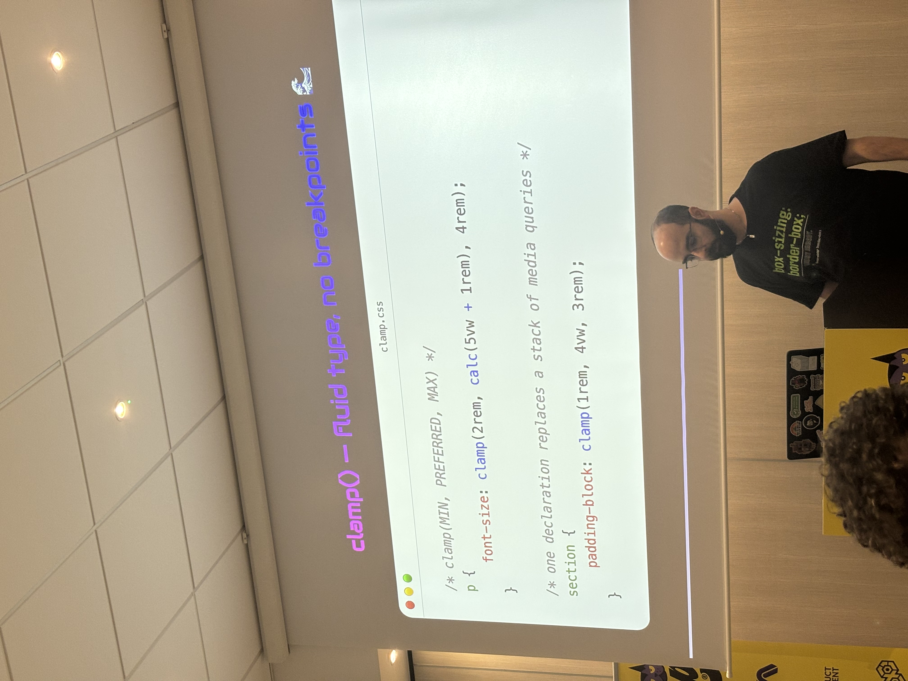
- container query
- :has()

#### Feature non ancora esistenti

- query a style property — manca firefox
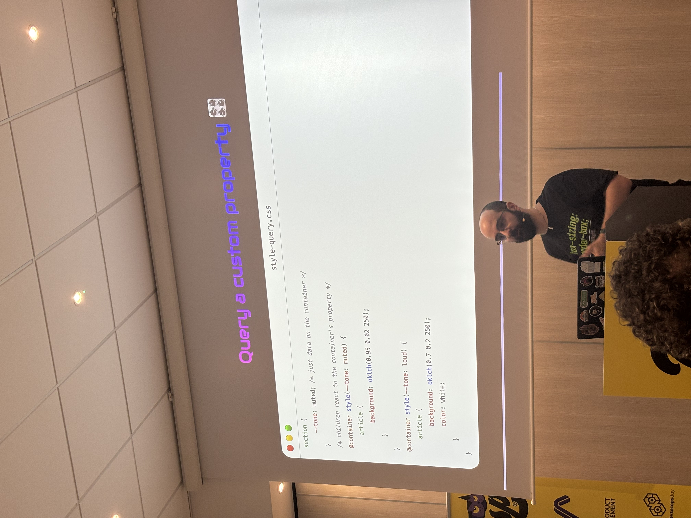
- if()
	- solo inline value :( niente blocchi di css

#### Slide

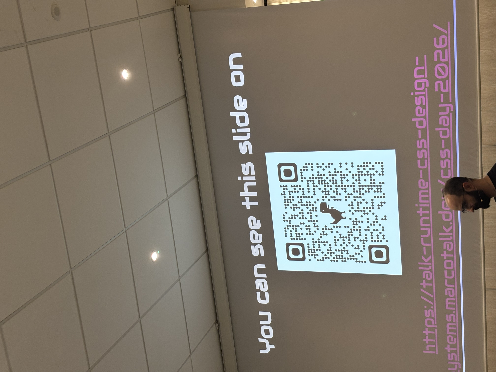

### L'effetto farfalla del CSS

- ITCSS — Harry Roberts — https://csswizardry.com
- BEM

### Oklab Color Space

#### Oklab

- Si basa si CIELAB
#### OKLCH

- Utilizza le coordinate polari del colore
- gestisce **luminosita + saturazione + hue**

#### HUE Wheel

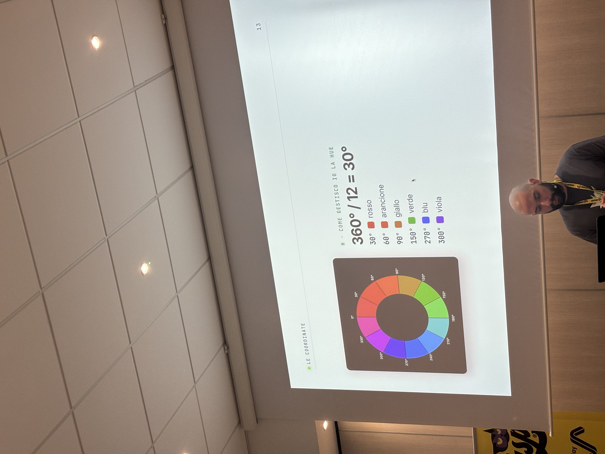

#### Slide

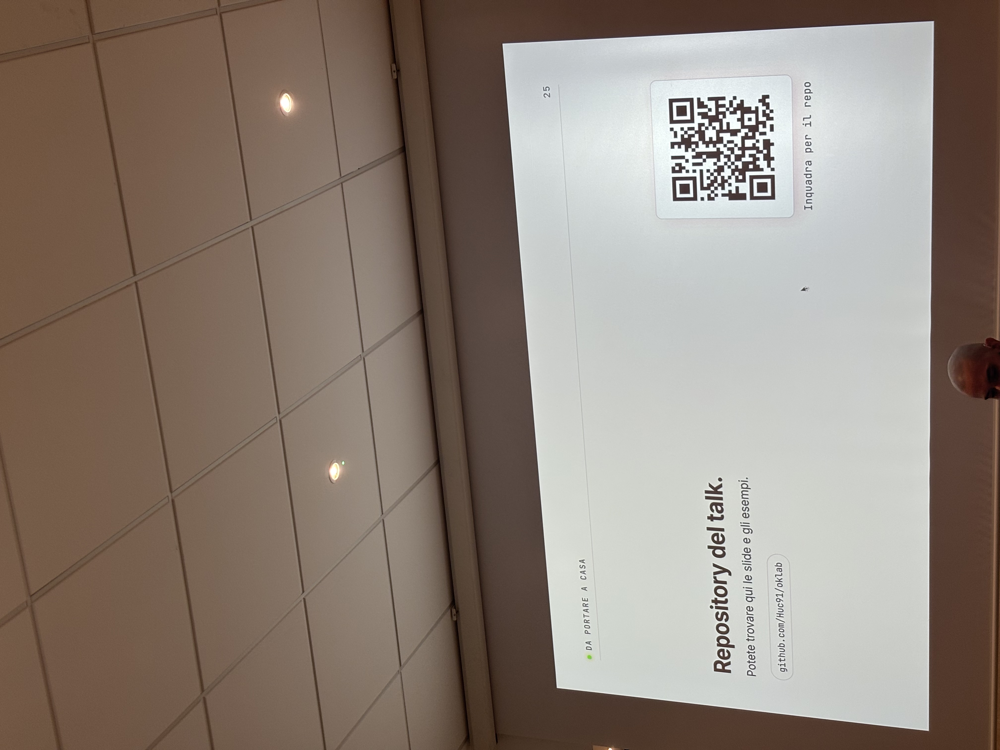

### Perchè mi piacciono così tanto i font variabili

- usati molto nelle icon font di material

### Contro il mito della disruption: CSS e il valore di ciò che dura

- AI come strumento intermedio per evitare le dipendenze
#### Slide

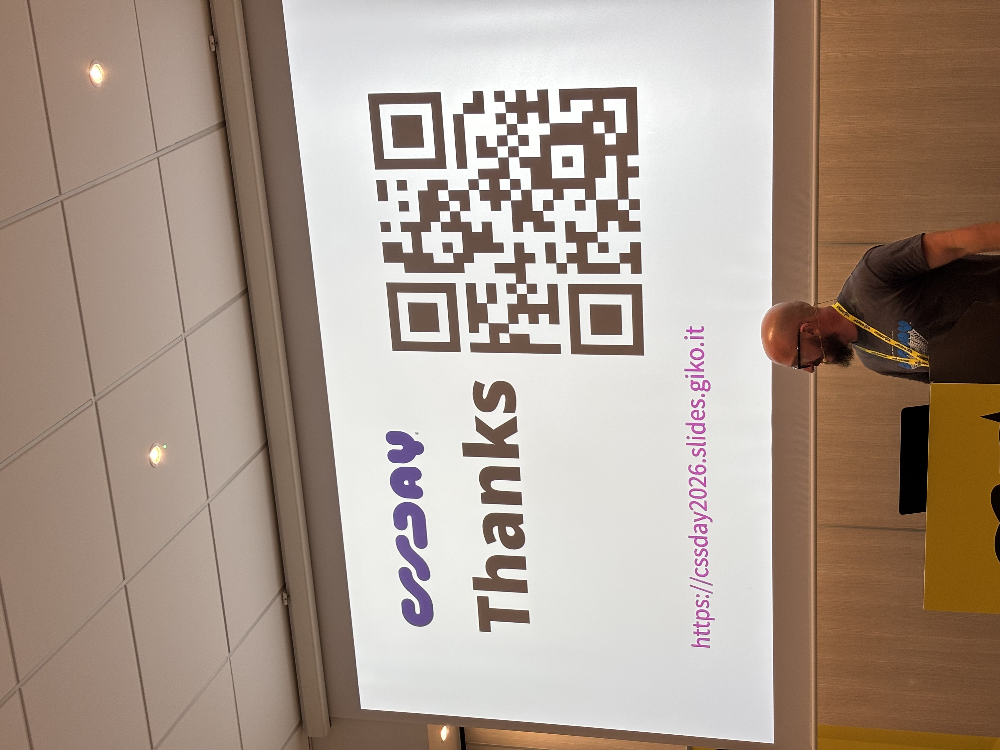
### Resilienza: farsi una doccia con il CSS

#### Slide

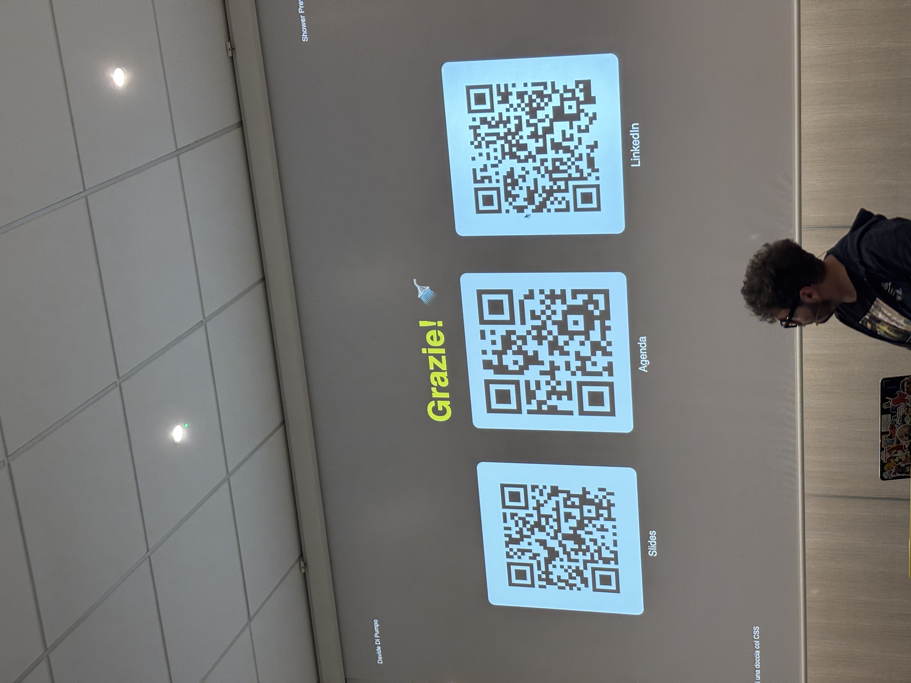

### Ehi Gemini, sistema il CSS! Parlare con i DevTools in linguaggio naturale

Il problema:

- gli agenti di codifica sono ciechi del browser
	- non vedono DOM
	- non vedono errori Console
	- non vedono la rete
	- non possono simulare device diversi

Soluzione?

- Chrome DevTools for Agents

Cosa contiene?

- Il server MCP
- Le skill per istruire meglio gli agenti su come usarlo
- Una cli per rispariarmare token :! ?

Come funziona?

- L'agente controlla il browser con Puppeteer
	- Sessione privata e isolata

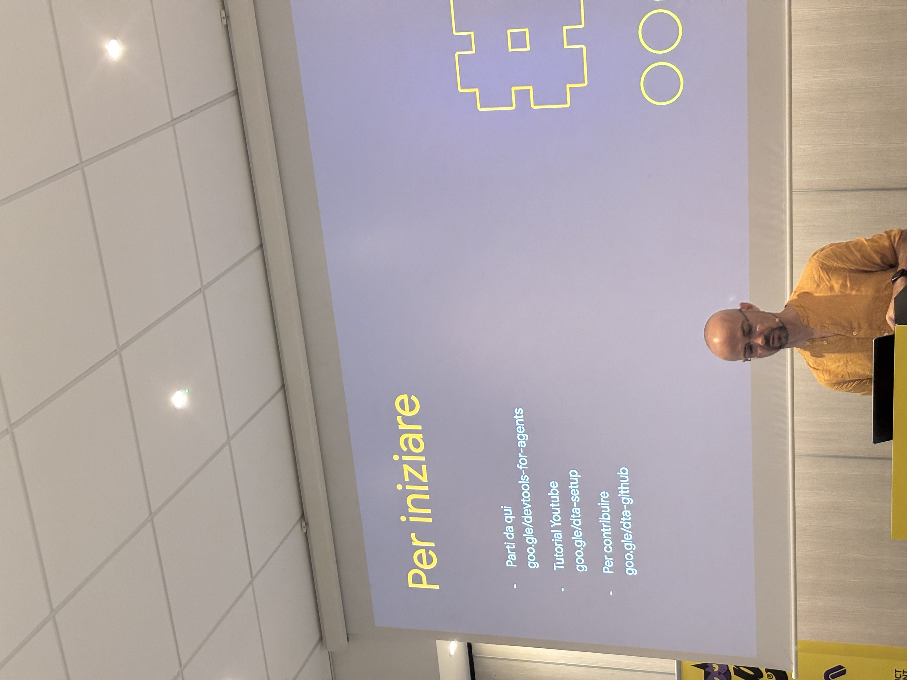

#### Slide ?
- **:( Sul suo sito**
